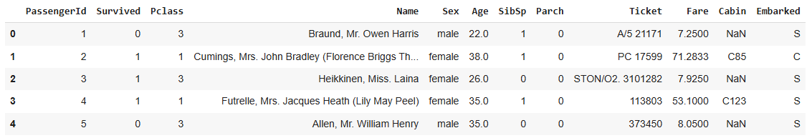
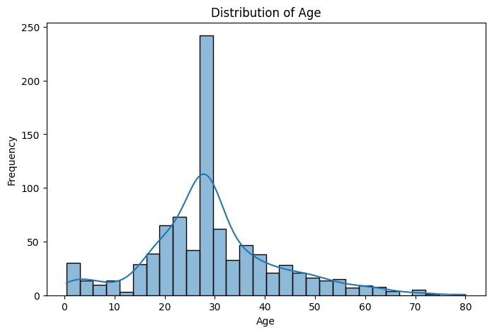
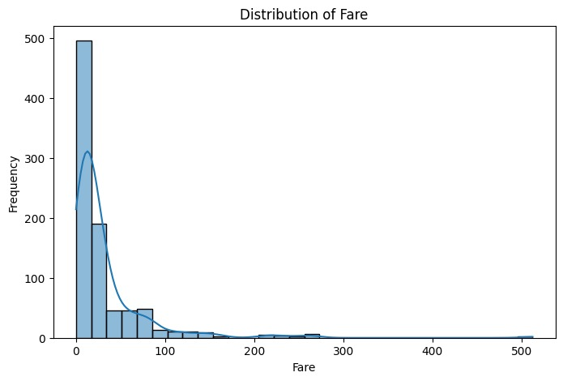
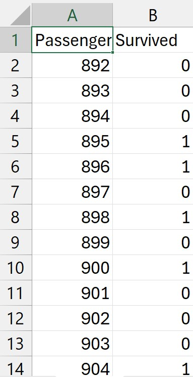

# Titanic Survival Prediction

This project aims to predict the survival of passengers aboard the Titanic based on various features such as class, age, sex, and embarkation port. The model uses machine learning techniques to classify passengers as either survived or deceased.

## Table of Contents
 - [About the Competition](#About-the-Competition)
 - [How It Works](#How-It-Works)
 - [Getting Started](#Getting-Started)
 - [Setup Instructions](#Setup-Instructions)
 - [Results](#Results)
 - [Images](#Images)

## About the Competition

This project is based on the Titanic: Machine Learning from Disaster competition on Kaggle. The goal of the competition is to predict whether a passenger survived or not, given a set of features. The dataset contains details about each passenger, such as age, class, and whether they were traveling alone or with family.
Link: 

## How It Works

 - Data Preprocessing: The raw data is cleaned and transformed into features like 'FamilySize', 'AgeGroup', and 'Title' to improve the model's predictive accuracy.
 - Model Selection: Several machine learning models, including Logistic Regression and Random Forest, were used to predict survival. Hyperparameter tuning was performed to achieve optimal performance.
 - Model Evaluation: The models were evaluated using accuracy and cross-validation techniques to ensure the best model is selected.
 - Prediction: The trained models are used to predict the survival status of passengers in the test dataset. The final predictions are submitted to the competition.

## Getting Started

To get started with the Titanic Survival Prediction project:

Clone this repository:

```bash
git clone https://github.com/ShubhamVankalas/Titanic-Survival-Prediction
cd titanic-survival-prediction
```

Install the required dependencies

Ensure that you have the following datasets (download them from Kaggle):

 - train.csv: The training data
 - test.csv: The test data for prediction

## Setup Instructions
To run the project, follow these steps:

### Data Preprocessing:

The preprocessing script handles missing values, feature engineering, and encoding categorical variables.

### Training the Model:

The model is trained using the preprocessed data, and the best hyperparameters are chosen using GridSearchCV.

### Making Predictions:

The trained model is used to predict the survival of passengers in the test.csv file.

### Generating the Submission File:

The predictions are formatted into a CSV file with columns PassengerId and Survived and saved for submission.


## Results
The best model achieved an accuracy of 82% on the test set after hyperparameter tuning. The Random Forest classifier was selected as the final model, with the following hyperparameters:

max_depth=30
min_samples_leaf=1
min_samples_split=5
n_estimators=50

## Images

### Train DataFrame


### Distribution Of Age


### Distribution Of Fare


### Output Excel Sheet



